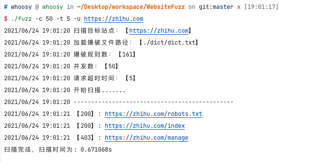

# WebsiteFuzz

Golang版对目标站点进行目录和文件爆破, 实现相似性汉明距离从而对404相似页面误报清理。

## 使用说明

```shell
go build
./fuzz -u http://baidu.com -d ./dict/dict.txt -t 3 -c 20

# 查看帮助
./fuzz -h

Usage of ./fuzz:
  -c int
        并发数 (default 8)
  -d string
        爆破字典路径 (default "./dict/dict.txt")
  -t int
        单个请求规则超时时间 (default 3)
  -u string
        目标站点地址

```



